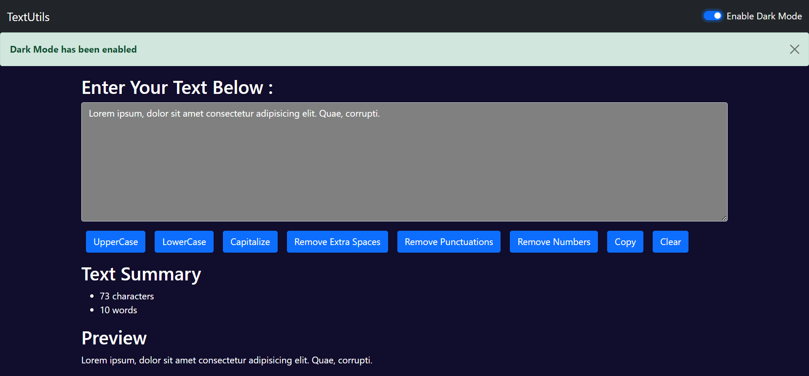
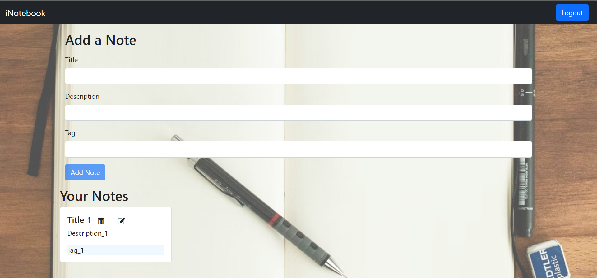
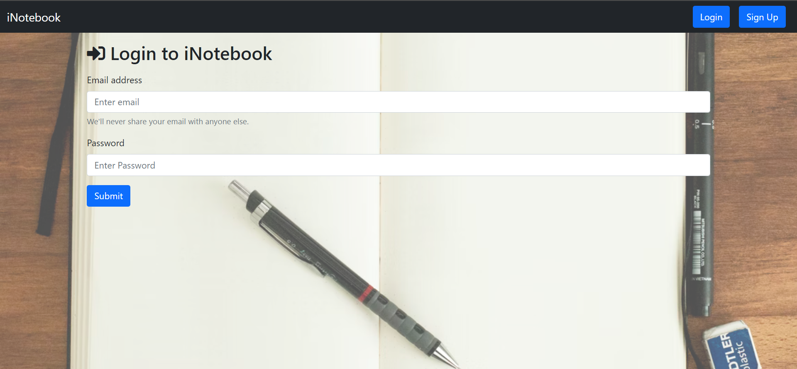

# Web Projects

A collection of independent web-development learning projects built with React, Node.js, and vanilla JavaScript.

| Project | Stack | Description |
| --- | --- | --- |
| [News Hunter](News%20Hunter/) | React | Category-based news reader using News API |
| [TextUtils](TextUtils/) | React | Text transformation utility |
| [To Do List](To%20Do%20List/) | HTML, CSS, JavaScript | Browser-based task list |
| [iNotebook](iNotebook/) | MERN | Authenticated notes application |

## Preview

| News Hunter | TextUtils | To Do List |
| --- | --- | --- |
|  |  |  |

| iNotebook sign in | iNotebook notes |
| --- | --- |
|  |  |

## Running A Project

Each directory is independent. Open the project README for its setup and run commands. React projects use their own `package.json`; do not run package commands from the repository root.

## Notes

- This repository is a learning portfolio, not a unified application.
- Store API keys, database URLs, and JWT secrets only in local environment files, never in Git.
- No license has been selected. Do not assume permission to copy, modify, or redistribute the projects.

## Contributing

See [CONTRIBUTING.md](CONTRIBUTING.md).
